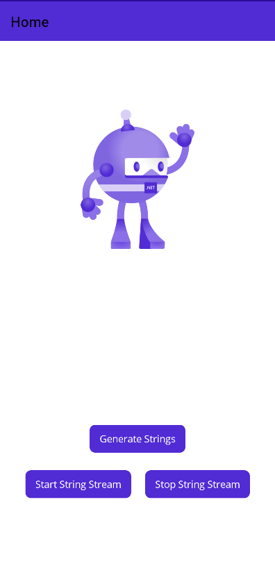

# Introduction
This sample is based on another sample for [MAUI Application](https://github.com/arvindd/MauiAppSample). The Location service in that application is now replaced with a "Random String Service" - which is provided by a java library. 

The whole point of this sample is to demonstrate use of a java library by creating a Java binding library in MAUI. The sample shows two aspects:

- C# code in MAUI invoking a java library function (i.e., synchornous java function call)
- Java function calling a C# function by use of a callback mechanism from Java library. This also means that we use C# code registers a function as a callback function with the Java code.

Use of the first one above is for normal usage of C# calling Java. The usecase for the second one is typically where Android sensors (internal or custom devices attached to mobiles via USB, etc.) stream data. The case is when such data streamers have java-based APIs provided by the device-vendors, MAUI/Xamarin C# code wraps that API for use. 

The code for the java project that generates the jar lib is also within this repository in the [Java](Java) folder. This project build with Gradle. You can use gradle directly from commandline to build this or use your favourite java IDE to build. The final jar that is built from this project gets directly into the Android Java Binding project JavaRandomStringBinding's [Jars](JavaRandomStringBinding/Jars) folder.

Note: The java project for generating the jar library is not needed for your purposes. What you need is only the final jar that it produces after the build.

# What does this sample do?
The sample application shows up like this:

There are three buttons:

- The first "Generate Strings" button invokes the backend Java function that generates a random string. This function is called 3 times to fill up a listview with 3 random strings. This is to demonstrate the normal use-case where C# calls Java code.
- The second button "Start string stream" registers a callback with Java code, and calls a Java function to now start a random-string stream. The random strings that are generated from the Java code fill up the ListView. This demonstrates callback from Java to C# code.
- The third button "Stop String Stream" calls a java function that stops the string stream

# Who can use this sample?
Everyone who develops mobile applications use [MAUI](https://dotnet.microsoft.com/en-us/apps/maui)

**AND**

Uses [Reactive Extensions](https://www.reactiveui.net/) (with all it's niceties such as Observables, Dynamic Data, etc.).

**AND**

Uses JNI for using a Java backend service API

If either of these are **NOT** a target of your application's design, this sample is **NOT** for you.

# How to...
## ...Add a new java service?
- Create a new "Android Java Binding Library" and add it to your main solution. Inside the project, create a "Jars" folder if it is not already present. Add your Java jar file into this folder. Building of this project will automatically create C# code that wraps this jar API - the generated code will be seen in the obj/-Debug/Release-/-platform-/generated folder.
- In your main project (which is MauiAppJnilibSample project in our sample), inside [Platforms/Android/Services](MauiAppJnilibSample/Platforms/Android/Services), add a C# class that will be creating objects of classes that are defined in the Jar (and calling methods of those Java-classes). If your java library is used also for data streaming (i.e., you want to support callbacks from Java, you will need to also need to make your class as an implementation of the Java interface that declares callback functions.Basically, the classes you add here are those that are mainly going to interact with Java. Make sure that your main project has the above Android Java Binding project as a dependency.
- Create a base-service (as an abstract class or an interface) for the service in [Services/Base](MauiAppJnilibSample/Services/Base). Make sure to derive this from [BaseService](MauiAppJnilibSample/Services/BaseService.cs)
- Add any data models your service will consume / generate in the [Models](MauiAppJnilibSample/Models) folder
- Add the real implementation of the service directly in the [Services](MauiAppJnilibSample/Services) folder. Make sure to also derive this real service from your base service abstract class / interface created above. Name this class with the same name as your class in the [Platform/Android/Services](MauiAppJnilibSample/Platform/Android/Services) folder above.
  - This class must create an instance of the Platform service. For any Java functions that this class must use, it can now use those functions via the platform instance.
- Register your service in [AppConfig.cs](MauiAppJnilibSample/AppConfig.cs):
  - Use `RegisterConstant()` (in Splat) for registering your service (mock or real) as a singleton
  - Create a property to hold a global instance of your service
  - Assign your service instance to the above property using `GetService()` (in Splat)

# Architecture of the sample
The sample has the same architecture as described in the [MauiAppSample](https://github.com/arvindd/MauiAppSample). Therefore, to understand the architecture in details, read through the specifics in that sample's page.

The only thing that changes is the part where services are added - these Java-services interact with C# services like this:

## Services and data Model

Services are those that generate data for (or consumes data from) ViewModels. This data that services generate or consume form the "Model" of MVVM. Since the real services are implemenented in Java, the models are also created in Java code.

# Contact
If you liked this sample, or want to feedback, [contact me on twitter](https://twitter.com/arvindd).
